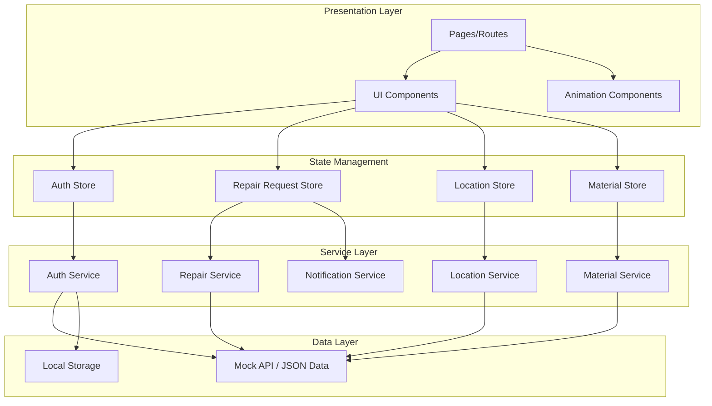
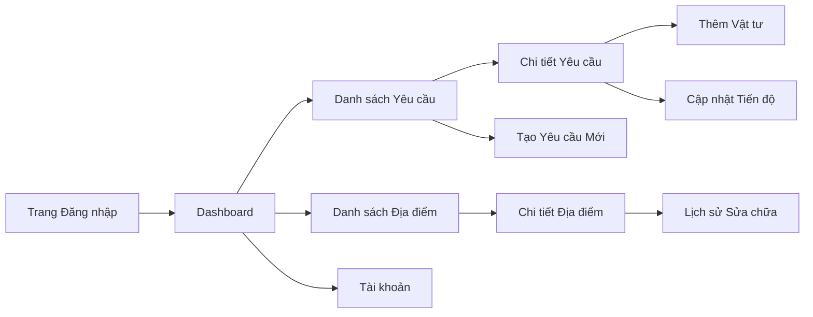
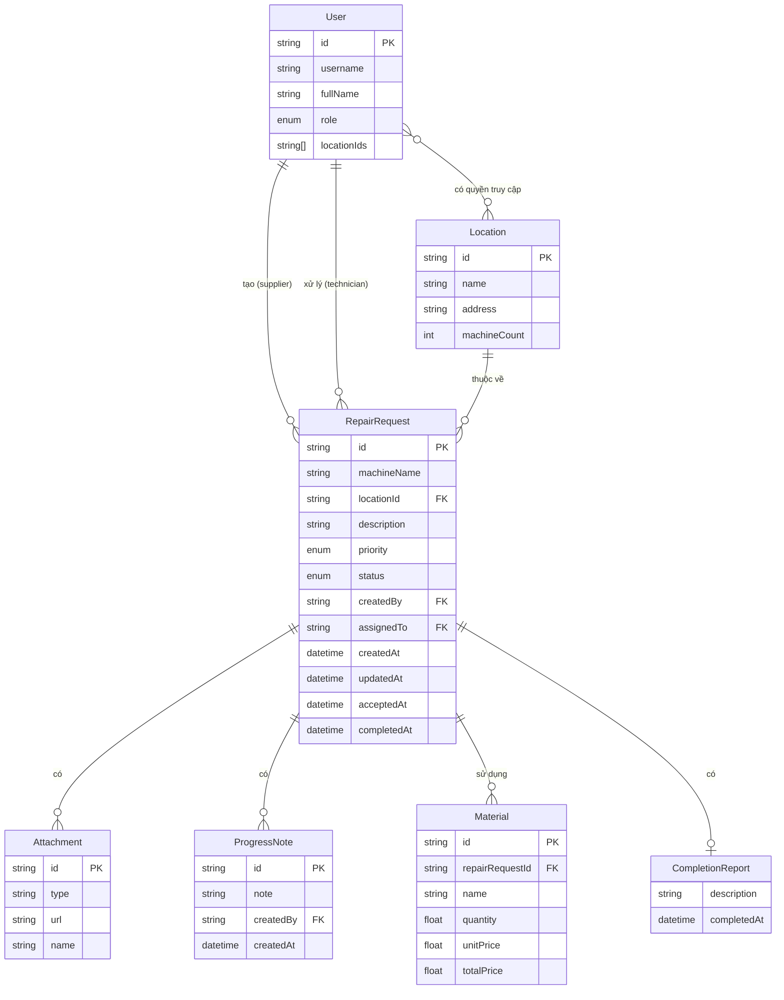
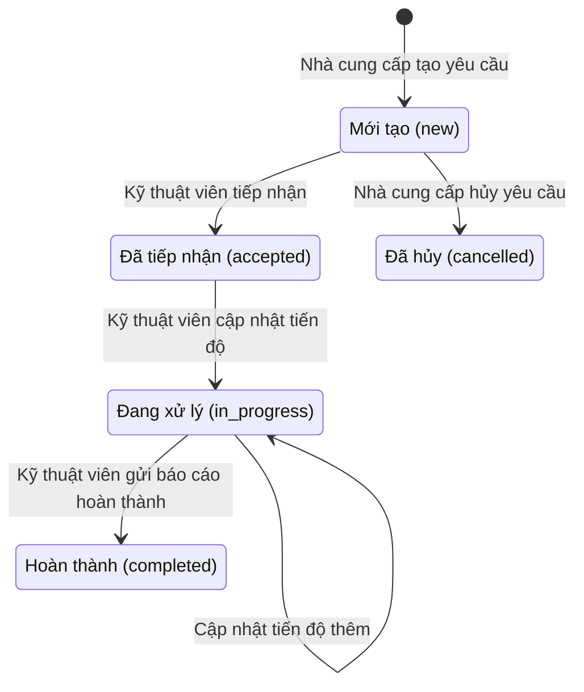

# Tài liệu Thiết kế: Quản lý Sửa chữa Máy móc

## Tổng quan

Ứng dụng mobile React.js quản lý sửa chữa máy móc đa địa điểm, phục vụ hai vai trò: Nhà cung cấp (tạo/theo dõi yêu cầu) và Kỹ thuật viên (tiếp nhận/xử lý yêu cầu). Ứng dụng sử dụng giao diện AI Neuralink với dark theme, particle animation và hiệu ứng glow. Dữ liệu được quản lý qua state management (Zustand) và mock API layer để dễ dàng tích hợp backend sau này.

### Quyết định thiết kế chính

- **React.js + Vite**: Build tool nhanh, hỗ trợ HMR tốt cho phát triển mobile web app
- **React Router v6**: Điều hướng SPA với lazy loading cho từng route
- **Zustand**: State management nhẹ, đơn giản hơn Redux, phù hợp với quy mô ứng dụng
- **Framer Motion**: Thư viện animation mạnh mẽ cho React, hỗ trợ gesture và layout animation
- **tsparticles**: Particle animation cho hiệu ứng neural network trên Dashboard
- **Recharts**: Thư viện biểu đồ React với hỗ trợ animation tích hợp
- **CSS Modules + CSS Variables**: Quản lý theme và style scoped theo component
- **Mock API Layer**: Abstraction layer cho API calls, dễ dàng thay thế bằng real API sau

## Kiến trúc



### Luồng điều hướng (Navigation Flow)



## Thành phần và Giao diện

### 1. Auth Module

```typescript
// types/auth.ts
interface User {
  id: string;
  username: string;
  fullName: string;
  role: 'supplier' | 'technician';
  locationIds: string[];
}

interface AuthState {
  user: User | null;
  token: string | null;
  isAuthenticated: boolean;
  login: (username: string, password: string) => Promise<LoginResult>;
  logout: () => void;
}

type LoginResult =
  | { success: true; user: User }
  | { success: false; error: string };
```

### 2. Repair Request Module

```typescript
// types/repair.ts
type RepairStatus = 'new' | 'accepted' | 'in_progress' | 'completed' | 'cancelled';

type Priority = 'low' | 'medium' | 'high' | 'critical';

interface RepairRequest {
  id: string;
  machineName: string;
  locationId: string;
  description: string;
  priority: Priority;
  status: RepairStatus;
  createdBy: string;
  assignedTo: string | null;
  attachments: Attachment[];
  progressNotes: ProgressNote[];
  materials: Material[];
  completionReport: CompletionReport | null;
  createdAt: string; // ISO 8601
  updatedAt: string;
  acceptedAt: string | null;
  completedAt: string | null;
}

interface Attachment {
  id: string;
  type: 'image' | 'video';
  url: string;
  name: string;
}

interface ProgressNote {
  id: string;
  note: string;
  createdBy: string;
  createdAt: string;
}

interface CompletionReport {
  description: string;
  attachments: Attachment[];
  completedAt: string;
}

interface RepairRequestFilters {
  status?: RepairStatus;
  locationId?: string;
  priority?: Priority;
}
```

### 3. Material Module

```typescript
// types/material.ts
interface Material {
  id: string;
  repairRequestId: string;
  name: string;
  quantity: number;  // phải > 0
  unitPrice: number; // phải > 0
  totalPrice: number; // = quantity * unitPrice
}

// Hàm tính tổng chi phí vật tư
function calculateTotalMaterialCost(materials: Material[]): number;

// Validation
interface MaterialValidationResult {
  valid: boolean;
  errors: string[];
}

function validateMaterial(material: Partial<Material>): MaterialValidationResult;
```

### 4. Location Module

```typescript
// types/location.ts
interface Location {
  id: string;
  name: string;
  address: string;
  machineCount: number;
}

interface LocationStats {
  locationId: string;
  totalRequests: number;
  byStatus: Record<RepairStatus, number>;
}
```

### 5. Repair History Module

```typescript
// types/history.ts
interface RepairHistoryEntry {
  repairRequest: RepairRequest; // chỉ status = 'completed'
  totalMaterialCost: number;
}

interface MachineRepairHistory {
  machineName: string;
  locationId: string;
  entries: RepairHistoryEntry[];
  cumulativeCost: number; // tổng chi phí tích lũy
}

interface HistoryFilters {
  dateFrom?: string;
  dateTo?: string;
  locationId?: string;
  machineName?: string;
}
```

### 6. UI Theme & Animation Components

```typescript
// theme/neuralink.ts
const neuralinkTheme = {
  colors: {
    background: '#0a0a0f',
    surface: '#12121a',
    surfaceLight: '#1a1a2e',
    primary: '#00d4ff',      // neon blue
    secondary: '#7b2ff7',    // purple
    accent: '#00ff88',       // neon green
    text: '#e0e0e0',
    textSecondary: '#8888aa',
    error: '#ff4466',
    warning: '#ffaa00',
    success: '#00ff88',
    glow: '0 0 20px rgba(0, 212, 255, 0.3)',
  },
  animation: {
    fast: '200ms',
    normal: '350ms',
    slow: '500ms',
    easing: 'cubic-bezier(0.4, 0, 0.2, 1)',
  },
};

// components/NeuralParticles.tsx - Particle background cho Dashboard
// components/GlowCard.tsx - Card với hiệu ứng glow border
// components/AnimatedButton.tsx - Button với ripple + glow effect
// components/AnimatedList.tsx - List với stagger animation
// components/PullToRefresh.tsx - Pull-to-refresh với neural loading animation
// components/SwipeableCard.tsx - Card hỗ trợ swipe gestures
// components/BottomNav.tsx - Bottom navigation bar
```

## Mô hình Dữ liệu

### Sơ đồ quan hệ



### Quy tắc chuyển đổi Trạng thái



### Quy tắc chuyển đổi trạng thái hợp lệ

```typescript
const validTransitions: Record<RepairStatus, RepairStatus[]> = {
  'new': ['accepted', 'cancelled'],
  'accepted': ['in_progress'],
  'in_progress': ['in_progress', 'completed'],
  'completed': [],
  'cancelled': [],
};

function isValidTransition(from: RepairStatus, to: RepairStatus): boolean {
  return validTransitions[from].includes(to);
}
```

## Thuộc tính Đúng đắn (Correctness Properties)

*Thuộc tính đúng đắn là một đặc điểm hoặc hành vi phải luôn đúng trong mọi lần thực thi hợp lệ của hệ thống — về cơ bản là một phát biểu hình thức về những gì hệ thống phải làm. Các thuộc tính này đóng vai trò cầu nối giữa đặc tả dễ đọc cho con người và đảm bảo tính đúng đắn có thể kiểm chứng bằng máy.*

### Property 1: Phân quyền theo vai trò

*Với mọi* user đã đăng nhập, danh sách chức năng hiển thị phải chỉ chứa các chức năng tương ứng với role của user đó (supplier chỉ thấy chức năng supplier, technician chỉ thấy chức năng technician), và không chứa chức năng của role khác.

**Validates: Requirements 1.3, 1.4**

### Property 2: Đăng nhập hợp lệ trả về đúng user

*Với mọi* cặp username/password hợp lệ trong hệ thống, hàm login phải trả về kết quả thành công với user có role khớp với dữ liệu đã đăng ký.

**Validates: Requirements 1.1**

### Property 3: Đăng nhập không hợp lệ bị từ chối

*Với mọi* cặp username/password không tồn tại trong hệ thống, hàm login phải trả về kết quả thất bại với thông báo lỗi, và trạng thái xác thực không thay đổi.

**Validates: Requirements 1.2**

### Property 4: Tạo yêu cầu sửa chữa hợp lệ

*Với mọi* bộ thông tin đầy đủ hợp lệ (tên máy không rỗng, địa điểm tồn tại, mô tả không rỗng, mức ưu tiên hợp lệ), yêu cầu sửa chữa được tạo phải có trạng thái "new", mã định danh duy nhất, và chứa đúng thông tin đã nhập.

**Validates: Requirements 2.1**

### Property 5: Yêu cầu sửa chữa thiếu thông tin bị từ chối

*Với mọi* bộ thông tin thiếu ít nhất một trường bắt buộc (tên máy, địa điểm, mô tả, mức ưu tiên), hệ thống phải từ chối tạo yêu cầu và trả về danh sách lỗi chỉ rõ từng trường còn thiếu.

**Validates: Requirements 2.2**

### Property 6: Lọc và sắp xếp danh sách yêu cầu sửa chữa

*Với mọi* danh sách yêu cầu sửa chữa và bộ filter (theo trạng thái, địa điểm), tất cả kết quả trả về phải thỏa mãn điều kiện lọc, và danh sách phải được sắp xếp giảm dần theo thời gian tạo.

**Validates: Requirements 2.4, 4.2**

### Property 7: Danh sách kỹ thuật viên sắp xếp theo ưu tiên

*Với mọi* danh sách yêu cầu sửa chữa của kỹ thuật viên, kết quả phải được sắp xếp theo mức độ ưu tiên giảm dần (critical > high > medium > low).

**Validates: Requirements 3.1**

### Property 8: Chuyển đổi trạng thái hợp lệ

*Với mọi* yêu cầu sửa chữa và thao tác chuyển trạng thái, chỉ các chuyển đổi hợp lệ theo state machine (new→accepted, accepted→in_progress, in_progress→completed, new→cancelled) mới được thực hiện thành công, và các chuyển đổi không hợp lệ phải bị từ chối.

**Validates: Requirements 3.2, 3.3, 3.4**

### Property 9: Cập nhật tiến độ thiếu ghi chú bị từ chối

*Với mọi* chuỗi ghi chú rỗng hoặc chỉ chứa khoảng trắng, thao tác cập nhật tiến độ phải bị từ chối và trạng thái yêu cầu không thay đổi.

**Validates: Requirements 3.5**

### Property 10: Quyền truy cập địa điểm khớp với user

*Với mọi* user, danh sách địa điểm hiển thị phải chính xác bằng tập hợp các địa điểm trong locationIds của user đó — không thừa, không thiếu.

**Validates: Requirements 4.1**

### Property 11: Thống kê Dashboard chính xác

*Với mọi* tập dữ liệu yêu cầu sửa chữa thuộc các địa điểm mà user có quyền truy cập, số lượng yêu cầu theo từng trạng thái trên Dashboard phải bằng đúng số lượng thực tế khi đếm trực tiếp từ dữ liệu.

**Validates: Requirements 4.3, 5.1**

### Property 12: Danh sách gần đây giới hạn 10

*Với mọi* tập dữ liệu yêu cầu sửa chữa, danh sách "gần đây" trên Dashboard phải có tối đa 10 phần tử, được sắp xếp giảm dần theo thời gian tạo, và nếu tổng số yêu cầu > 10 thì chỉ lấy 10 yêu cầu mới nhất.

**Validates: Requirements 5.2**

### Property 13: Bất biến tổng chi phí vật tư

*Với mọi* danh sách vật tư của một yêu cầu sửa chữa, sau bất kỳ thao tác nào (thêm, sửa, xóa vật tư), tổng chi phí phải luôn bằng tổng của (quantity × unitPrice) cho mỗi vật tư còn lại trong danh sách.

**Validates: Requirements 7.1, 7.2, 7.5**

### Property 14: Giá trị vật tư không hợp lệ bị từ chối

*Với mọi* giá trị số lượng hoặc đơn giá không hợp lệ (số âm, bằng 0, NaN, Infinity, không phải số), hệ thống phải từ chối lưu vật tư và trả về thông báo lỗi.

**Validates: Requirements 7.3**

### Property 15: Lịch sử sửa chữa chỉ chứa yêu cầu hoàn thành

*Với mọi* máy móc, danh sách lịch sử sửa chữa phải chỉ chứa các yêu cầu có trạng thái "completed", và được sắp xếp giảm dần theo thời gian hoàn thành.

**Validates: Requirements 8.1**

### Property 16: Lọc lịch sử sửa chữa chính xác

*Với mọi* bộ filter lịch sử (khoảng thời gian, địa điểm, tên máy), tất cả kết quả trả về phải thỏa mãn đồng thời tất cả điều kiện lọc đã chọn.

**Validates: Requirements 8.3**

### Property 17: Tổng chi phí tích lũy chính xác

*Với mọi* máy móc, tổng chi phí sửa chữa tích lũy phải bằng tổng chi phí vật tư của tất cả yêu cầu sửa chữa đã hoàn thành cho máy đó.

**Validates: Requirements 8.4**

## Xử lý Lỗi

### Xác thực đầu vào

| Tình huống | Xử lý |
|---|---|
| Đăng nhập sai thông tin | Hiển thị "Tên đăng nhập hoặc mật khẩu không đúng", không tiết lộ trường nào sai |
| Tạo yêu cầu thiếu trường | Highlight trường lỗi, hiển thị message cụ thể cho từng trường |
| Vật tư có giá trị không hợp lệ | Hiển thị lỗi inline dưới trường nhập, không cho submit |
| Ghi chú tiến độ rỗng | Hiển thị "Vui lòng nhập ghi chú mô tả tiến độ" |

### Chuyển đổi trạng thái không hợp lệ

| Tình huống | Xử lý |
|---|---|
| Chuyển trạng thái không hợp lệ | Từ chối thao tác, hiển thị thông báo giải thích trạng thái hiện tại và các chuyển đổi cho phép |
| Thao tác không đúng quyền | Ẩn nút/action không thuộc quyền, nếu gọi API trực tiếp thì trả về lỗi 403 |

### Lỗi mạng và dữ liệu

| Tình huống | Xử lý |
|---|---|
| Mất kết nối mạng | Hiển thị banner "Mất kết nối", cho phép retry |
| API trả về lỗi | Hiển thị toast notification với thông báo lỗi, log chi tiết vào console |
| Dữ liệu không tải được | Hiển thị empty state với nút "Thử lại" |
| Session hết hạn | Redirect về trang đăng nhập với thông báo |

## Chiến lược Kiểm thử

### Thư viện và Công cụ

- **Vitest**: Test runner chính, tương thích tốt với Vite
- **React Testing Library**: Test UI components
- **fast-check**: Thư viện property-based testing cho TypeScript/JavaScript
- **MSW (Mock Service Worker)**: Mock API calls trong tests

### Unit Tests

Unit tests tập trung vào các trường hợp cụ thể và edge cases:

- Kiểm tra từng hàm validation riêng lẻ với input cụ thể
- Kiểm tra state transitions với các trạng thái cụ thể
- Kiểm tra rendering components với mock data cụ thể
- Kiểm tra error handling với các lỗi cụ thể
- Kiểm tra edge cases: danh sách rỗng, giá trị biên, Unicode characters

### Property-Based Tests

Mỗi property test phải:
- Chạy tối thiểu 100 iterations
- Tham chiếu đến property number trong design document
- Sử dụng format tag: **Feature: machine-repair-management, Property {N}: {title}**
- Mỗi correctness property được implement bằng đúng MỘT property-based test

Danh sách property tests:

| Property | Mô tả | Generator |
|---|---|---|
| P1 | Phân quyền theo vai trò | Random users với random roles |
| P2 | Đăng nhập hợp lệ | Random valid credentials |
| P3 | Đăng nhập không hợp lệ | Random invalid credentials |
| P4 | Tạo yêu cầu hợp lệ | Random valid repair request data |
| P5 | Yêu cầu thiếu thông tin | Random incomplete repair request data |
| P6 | Lọc và sắp xếp danh sách | Random lists + random filters |
| P7 | Sắp xếp theo ưu tiên | Random lists với random priorities |
| P8 | Chuyển đổi trạng thái | Random status pairs |
| P9 | Ghi chú rỗng bị từ chối | Random whitespace strings |
| P10 | Quyền truy cập địa điểm | Random users + random locations |
| P11 | Thống kê Dashboard | Random repair request datasets |
| P12 | Giới hạn 10 gần đây | Random lists với length > 10 |
| P13 | Bất biến tổng chi phí | Random material lists + random operations |
| P14 | Giá trị vật tư không hợp lệ | Random invalid numbers |
| P15 | Lịch sử chỉ completed | Random mixed-status lists |
| P16 | Lọc lịch sử | Random history data + random filters |
| P17 | Tổng chi phí tích lũy | Random completed requests với materials |
